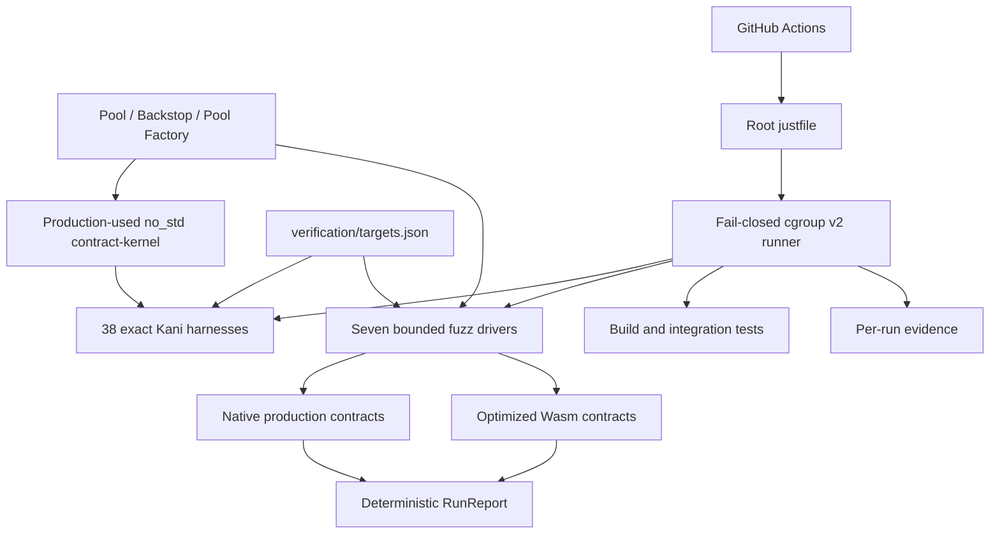

# Verification Architecture and Audit Readiness

**Status:** Implemented design record  
**Last locally validated:** 2026-09-19  
**Applies to:** `pool`, `backstop`, `pool-factory`, `contract-kernel`, `test-suites/fuzz`, `verification/targets.json`, the root `justfile`, and the verification workflows

## 1. Purpose

This document records the major design decisions behind Blend's bounded verification system, why each decision was made, what correctness claim it supports, and what evidence a security reviewer can reproduce.

The system adds three complementary layers:

1. production and integration tests for Soroban-facing behavior;
2. coverage-guided execution of the production contracts in native and optimized-Wasm modes; and
3. bounded model checking of a small, host-free policy kernel that the production contracts call directly.

A fourth layer, the root verification runner, makes those checks operationally safe and records how each check ran.

This is an audit-readiness mechanism, not an audit result. It reduces ambiguity, makes important claims reproducible, and gives reviewers concrete counterexample and run artifacts. It does not establish that the contracts are vulnerability-free.

## 2. Scope and trust boundaries

### 2.1 Owned production subjects

The repository owns three production contracts:

- `pool`
- `backstop`
- `pool-factory`

The verification registry maps all seven fuzz targets and all 38 Kani harnesses to these subjects. Mock contracts remain fixtures and are not counted as verified production contracts.

### 2.2 External or deliberately unproved components

The following remain outside the formal proof boundary:

- Soroban host execution, authorization machinery, storage atomicity, and SDK internals;
- cryptographic signature verification;
- the externally supplied emitter and Comet Wasm binaries;
- token, oracle, and flash-loan receiver fixture correctness;
- deployment configuration on a live network;
- unbounded operation sequences and unbounded nonlinear financial arithmetic.

Native/Wasm replay and integration tests exercise some of these boundaries, but exercising a dependency is not a proof of that dependency.

### 2.3 Meaning of “audit-ready” here

For this repository, audit-ready means that a reviewer can:

- identify the production symbol behind a property;
- identify the independent oracle or invariant used to check it;
- see the exact finite domain of a bounded proof;
- reproduce the check through one documented command;
- confirm that the intended target or harness was discovered rather than silently skipped;
- inspect tool versions, resource limits, output, termination status, and memory evidence;
- replay a committed input in native and Wasm modes; and
- distinguish established properties from explicit non-claims.

It does not mean that every public entrypoint has a complete economic specification or that short fuzz campaigns establish coverage completeness.

## 3. Architecture



The layers intentionally overlap:

- Kani is strongest for small, pure state transitions and boundary predicates.
- Fuzzing is strongest for multi-call contract behavior and generated inputs.
- Native/Wasm replay checks representation and deployment-path consistency for deterministic seeds.
- Existing tests retain broad protocol scenarios, authorization assertions, and fixtures that do not belong in the proof kernel.

No single layer is treated as a substitute for the others.

## 4. Decision record

### D1. Use one root `justfile` as the verification interface

**Decision.** Build, test, replay, fuzz, and proof commands enter through the root `justfile`. `just build` and `just test` delegate to the existing Makefile rather than duplicating production build logic.

**Why.** A single command surface prevents local and CI execution from drifting. Delegating existing build rules preserves the repository's established Wasm build behavior.

**Correctness effect.** The same source, lockfiles, and production build path are used by developers and automation.

**Auditability effect.** Reviewers have a finite public interface:

```console
just verify-doctor
just verify-self-test
just build
just test
just verify-list fuzz all
just fuzz-replay all both
just fuzz all 60 1
just verify-list kani all
just kani
```

Private recipes implement narrow mechanics and are not alternate public workflows.

### D2. Fail closed unless each verification workload is inside a hard cgroup

**Decision.** Every public build, test, replay, fuzz, proof, and locked-dependency
fetch workload runs in a transient systemd service with cgroup-v2 enforcement.
The default policy is:

- 4 GiB maximum memory for the complete process tree;
- zero swap;
- `memory.oom.group=1` and whole-cgroup termination;
- 256 tasks;
- 200% CPU quota;
- one repository-wide verification workload at a time;
- serial Cargo builds, tests, fuzzers, and proofs where configured.

The private guard re-reads its own effective cgroup before executing the
workload. Missing delegation, an unlimited memory controller, insufficient
host headroom, invalid settings, or an overlapping run is an error. There is
no unbounded fallback inside these public recipes.

**Why.** Kani, CBMC, Cargo, and sanitizers can create large process trees. A per-process RSS option does not constrain compiler children or solver descendants and cannot prevent host OOM. Serial execution also makes peak-memory evidence attributable to one workload.

**Correctness effect.** Resource exhaustion becomes an explicit failed check instead of an ambiguous crash, silently killed solver, or damaged workstation.

**Auditability effect.** `verify-self-test` exercises startup rejection, exact exit-status propagation, timeout, cgroup OOM, lock contention, SIGINT, SIGTERM, and no-survivor behavior. This tests the evidence-producing mechanism rather than assuming it works.

Just 1.51.0 is the minimum supported version. Older Just behavior did not reliably terminate the transient unit on SIGINT in the complete cancellation path; accepting it would make local and CI cancellation claims false.

CI bootstraps Rust toolchains and installs the pinned Just, cargo-fuzz, and Kani
binaries before Just is available. Those installation steps are covered by the
finite workflow job timeout but not by the 4 GiB cgroup guard. The hard-cap
claim begins with the contained dependency fetch and public verification
recipes; audit evidence must not attribute the bootstrap installations to it.

### D3. Extract only host-free policies, and make production call them

**Decision.** `contract-kernel` is a dependency-free, `no_std` Rust library. Production code calls it for:

| Policy family | Kernel functions | Production effect |
|---|---|---|
| Pool configuration | `config::valid_pool_config` | Shared pool/factory validation bounds |
| Pool state | `pool::next_status`, `pool::admin_status` | Automatic and administrative status transitions |
| Action gating | `pool::action_allowed`, `pool::reserve_action_allowed` | Pool/reserve request permission predicates |
| Auction schedule | `pool::auction_modifiers` | Bid/lot modifiers across elapsed blocks |
| Backstop threshold | `pool::backstop_threshold`, `backstop::above_threshold` | Shared threshold product and scaling |
| Withdrawal queue | `backstop::consume_queue_entry`, `backstop::withdraw_queue_entry` | Queue conservation and maturity transition |
| Backfill cap | `backstop::cap_backfill` | Emission allocation ceiling |

The Soroban clients, maps, vectors, storage, events, authentication, and cross-contract calls stay in their existing contracts.

**Why.** Symbolically compiling the Soroban host would be expensive and would obscure the protocol decisions being proved. A duplicate “model” implementation would be worse: proofs could pass while production diverged. The kernel is therefore small but production-used.

**Correctness effect.** A successful proof constrains code that executes in production, not a detached specification. Centralization also removes duplicated threshold and configuration predicates.

**Auditability effect.** Each proof can name one production-used function and a small independent reference without requiring a reviewer to trust a host stub.

### D4. Preserve one signed, saturating threshold formula and prove its production wrappers directly

**Decision.** The threshold kernel retains the original formula as its only
production implementation. It truncates each raw balance to whole units, forms
`BLND^4 * USDC` through signed `i128::saturating_mul`, derives the scaled
numeric value with `product.saturating_mul(10^7) / 10^25`, and compares the same
product with `10^25` for the boolean predicate. Both
`pool::backstop_threshold` and `backstop::above_threshold` call that shared
helper. There is no optimized branch or alternate production arithmetic.

**Why.** A proof-oriented shortcut in the production function creates a second
arithmetic implementation and an unnecessary compatibility surface. Kani
tractability belongs in the harness: balances are constructed from narrow
symbolic seeds, monotonicity increases are bounded, and only intervals that hit
the 600-second deadline are bisected without shrinking the overall domain.

**Correctness effect.** Agreement harnesses compare both production results
with an independent ordinary-multiplication oracle over the documented
`u8`-seed domain and raw-unit remainder cases. Monotonicity harnesses call the
two public production wrappers before and after a `0..=1_000` whole-unit
increase in either axis, asserting numeric monotonicity, predicate
monotonicity, and boolean/numeric agreement.

**Auditability effect.** The registry exposes every contiguous partition and
required threshold-side cover. The boundary harness separately checks signed
inputs, saturation extremes, exact threshold equality, and raw-unit neighbors.

**Residual obligation.** These are bounded nonlinear proofs, not a
universally quantified proof over every `i128` pair. Signed and saturating
behavior outside the concrete boundary points remains an explicit manual and
integration-test review surface.

### D5. Use bounded Kani proofs with explicit domains and non-vacuity witnesses

**Decision.** Kani 0.68.0 runs 38 exact harnesses, one at a time, with Kissat, safety and overflow checks enabled, `--jobs=1`, and a 600-second harness timeout.

The proof inventory is:

| Group | Harnesses | Domain and purpose |
|---|---:|---|
| Factory/shared config | 1 | Full-width configuration inputs and exact boundary truth table |
| Pool | 4 | Full-width status/action predicates and all-`u32` auction schedule |
| Backstop threshold agreement | 8 | Contiguous BLND-seed tiles covering `0..=255`; USDC spans `u8`; documented raw-unit remainders |
| Backstop threshold monotonicity | 21 | Contiguous BLND-seed partitions covering `0..=255` in each increase direction; timed-out intervals are bisected without dropping seeds |
| Threshold boundaries | 1 | Signed inputs, saturating extremes, exact equality, and raw-unit neighbors through both production wrappers |
| Queue/emissions | 3 | Full-width nonnegative queue amounts, full-width maturity times, and bounded backfill domain |

Every assumption is intended to be either an API precondition or an explicit tractability bound. Required `kani::cover!` labels witness branch and boundary reachability. Low threshold tiles omit covers that are mathematically impossible in those tiles rather than pretending they are reachable.

**Why.** Bounded proofs are useful only when their domain is explicit. Partitioning preserves the stated finite domain while avoiding a silent reduction of symbolic width.

**Correctness effect.** The harnesses exhaustively check their encoded finite/full-width domains rather than sampling them.

**Auditability effect.** Proof comments state scope, assumptions, oracle, unwind bound, and covers. Exported Kani JSON must report exactly one successful requested harness, no failed/undetermined/solver-error/unsatisfiable properties, and every registered cover satisfied by exact name.

The result gate does not claim that every compiler-generated check is reachable. Non-vacuity is enforced through the explicit registered covers; reviewers should inspect any additional unreachable generated checks when changing proof control flow.

Kani 0.68.0 also requires a Kani-only `repr(C)` on `QueueStep` to avoid an upstream compiler panic when reading the niche-encoded `Result<QueueStep, NotExpired>` discriminant. The attribute is active only for proof compilation; production and Wasm retain their normal Rust representation.

### D6. Make target discovery finite and exact

**Decision.** `verification/targets.json` is the checked inventory for seven fuzz targets, their contract/entrypoint scope, 38 Kani harnesses, proof groups, partitions, and cover labels.

Before execution:

- fuzz target names must exactly equal `cargo fuzz list`;
- Kani harness names must exactly equal versioned `cargo kani list` schema 0.1;
- threshold agreement partitions must cover `0..=255` contiguously;
- threshold monotonicity partitions must cover `0..=255` in both increase directions;
- unknown, empty, duplicate, missing, or extra selections fail.

**Why.** A green command is meaningless if a renamed or undiscovered target silently disappears.

**Correctness effect.** Registry drift becomes a hard failure before the selected workload runs.

**Auditability effect.** The registry is a machine-readable traceability index rather than a prose-only coverage claim.

### D7. Keep fuzz programs deterministic and structurally bounded

**Decision.** All seven fuzz binaries use one fixed-width decoder:

- one header byte;
- zero to eight eight-byte operations;
- fixed operation fields (`code`, `actor`, `asset`, `flags`, `amount`);
- explicit outcomes for empty, empty-program, oversized, truncated, and trailing input.

The libFuzzer runner sets `-max_len=65`, exactly matching the largest accepted
program: one header byte plus eight eight-byte operation records.

Each execution creates a fresh deterministic Soroban fixture. The fuzzer does not catch panics. Client return-conversion failures, invocation aborts, and non-contract Soroban runtime errors fail the input; only invocation errors whose `ScErrorType` is exactly `Contract` are recorded as rejected transitions.

The general fixture uses `MockPoolFactory` in native mode as a setup
dependency. The dedicated `fuzz_pool_factory` driver does not count that mock:
it registers the production `PoolFactoryContract` natively and gives it the
actual optimized Pool Wasm hash. Wasm mode registers the optimized production
factory Wasm. This keeps factory coverage attached to owned code in both
logical modes.

**Why.** Bounded programs prevent input-controlled allocation and make every reproducer easy to decode. Fresh fixtures remove order dependence between libFuzzer iterations.

**Correctness effect.** Crashes and assertions remain visible to libFuzzer. The operation cap bounds runtime and state growth.

**Auditability effect.** A seed is a complete deterministic program, not a hidden sequence depending on prior corpus execution.

**Trade-off.** The common `contract_call` classifier accepts only runtime-typed `Contract` errors as generated rejections, but it intentionally does not prove that every such rejection used the operation-specific error code. Target-specific assertions defend selected boundaries, including exact pool-status codes. Auditors should treat other rejection-only paths as exploration, not a complete negative-path specification.

The current fixtures leave Soroban's host budget unlimited for scenario
execution. The cgroup and libFuzzer timeout still bound machine resources, but
these campaigns do not establish production gas/CPU limits or per-operation
budget safety. A future finite-budget oracle must be treated as a separate
observable contract, not inferred from successful native execution.

### D8. Compare native and optimized-Wasm outcomes

**Decision.** Committed seeds run through the same decoder and scenario driver in native and optimized-Wasm modes. `both` mode requires exact equality of `RunReport`:

- input class;
- decoded operation count;
- applied/rejected/no-op counts; and
- a deterministic 64-bit fingerprint of explicitly observed state.

**Why.** Native source provides useful libFuzzer feedback, while Wasm exercises contract registration, serialization, and the actual deployment representation. Using one driver prevents replay semantics from drifting from fuzz semantics.

**Correctness effect.** A deterministic difference in observed behavior is a hard failure.

**Auditability effect.** Seventeen small committed seeds provide stable, reviewable reproductions for successful and rejected/boundary paths, including a maximal eight-operation program and the absent-auction getter no-op.

**Trade-off.** `RunReport.state` is not a hash of all ledger storage or events. Equality proves parity only for the observations mixed into each driver and the assertions executed along that path.

### D9. Use semantic assertions and deliberate mutation sensitivity

**Decision.** Drivers assert selected state and boundary properties instead of relying on “did not panic.” Examples include:

- pool/factory configuration bounds;
- conservative per-reserve asset coverage after accrued-rate rounding and
  backstop credit;
- independent post-success actor health after borrow and collateral withdrawal;
- exact status-transition results, error codes, and stored configuration;
- strict stale-auction deletion after 500 elapsed blocks;
- withdrawal maturity at `expires == now`;
- token/share deltas for deposit, withdrawal, donation, and draw;
- repeated emission claims transferring zero without new accrual; and
- deployment acceptance matching an independent configuration predicate.

Five temporary production mutations were used to demonstrate that relevant checks fail:

1. factory/pool configuration upper-bound comparison;
2. auction staleness comparison;
3. withdrawal maturity comparison;
4. required pool-user authorization; and
5. claim-accrual clearing.

The authorization mutation was detected by the existing integration suite, not by a fuzz-driver authorization oracle.

**Why.** An assertion that survives the defect it claims to detect provides little assurance. Deliberate mutations test sensitivity without retaining mutation switches in production.

**Correctness effect.** The checks have evidence of detecting these five concrete defect classes.

**Auditability effect.** `MUTATION-CHECK` comments identify the defending assertions. This is evidence for those mutations only, not mutation-score coverage of the repository.

### D10. Commit deep and boundary seeds; keep generated corpus transient

**Decision.** Seventeen seeds live under `test-suites/fuzz/seeds/<target>/`. Generated corpus and crash directories are ignored locally. CI uploads crash artifacts and run evidence for 14 days.

**Why.** Purely random campaigns often spend their budget on constructor and early-validation failures. Small successful transcripts make deeper state transitions reproducible from the first execution, while a mutable corpus can continue exploring locally or in CI.

**Correctness effect.** Known boundary scenarios run on every replay rather than depending on rediscovery.

**Auditability effect.** Seeds are reviewable repository inputs. A crash artifact can be replayed with one target through the instrumented binary and logical native/Wasm path.

### D11. Pin tools, preserve lockfiles, and run offline after fetch

**Decision.** The system pins Rust 1.81, `nightly-2025-11-25`,
cargo-fuzz 0.13.2, Kani 0.68.0, Stellar CLI 22.6.0, Just 1.51.0,
and immutable GitHub Action revisions. Dependency fetches use both lockfiles;
subsequent proof/fuzz work runs offline where supported. Lockfile hashes are
compared before and after the locked fetch, fuzz build, and Kani operations
that could otherwise alter them.

**Why.** Reproducibility requires more than a source revision. Solver, compiler, SDK, fuzz runner, and dependency drift can change behavior or evidence shape.

**Correctness effect.** Accidental dependency resolution cannot silently enter a verification run.

**Auditability effect.** Tool versions are recorded per contained run, and the expected versions are visible in workflow source.

### D12. Preserve evidence for success and failure

**Decision.** Every `verify-run` creates a unique directory under `target/verification/runs/` containing:

- `command.txt` — shell-escaped argv;
- `limits.json` — requested resource policy;
- `versions.txt` — Just/systemd/Cargo/Rust versions;
- `output.log` — streamed combined output;
- `unit` and `cgroup.path` — execution identity;
- `memory.events` and `systemd.properties` — cgroup/systemd accounting; and
- `result.json` — exit status, systemd result, peak memory, and OOM count.

Kani additionally exports per-harness JSON and its discovery document. Fuzzing preserves crash reproducers.

**Why.** A bare green check does not answer what ran, under which limits, or whether a timeout/OOM was mistaken for success.

**Correctness effect.** Timeout, OOM, cancellation, incomplete result, missing artifact, and solver error remain failures.

**Auditability effect.** Reviewers can audit both the test result and the runner that produced it.

## 5. Fuzz target traceability

This table describes the implemented drivers, not a future coverage aspiration.

| Target | Production calls and observations | Principal implemented assertions | Important residual scope |
|---|---|---|---|
| `fuzz_pool_general` | `submit`, `submit_with_allowance`, `claim`, config/reserve/position reads | Returned/stored position shape; conservative `cash + ceil(debt) >= floor(supplier claims) + backstop credit` per reserve after every operation; independent price/factor health after successful borrow or collateral withdrawal | No general auth oracle; contract rejections are not all error-code-specific; no complete independent interest-accrual model or diverse live-oracle behavior |
| `fuzz_pool_admin` | Admin proposal/acceptance, pool config, reserve queue/cancel/apply, status changes | Exact config acceptance and persistence; reserve-count/config invariants; kernel-backed status result, exact `1200`/`1204` mapping, rollback on rejection, and real `q4w_pct` transition coverage | Reserve timelock behavior and every reserve-operation error code are not exhaustively modeled |
| `fuzz_pool_auctions` | Interest auction type 2 and liquidation auction type 0 creation, interest get/delete, bad-debt processing | Created-auction existence/readability; absent-auction getter no-op; strict stale-deletion boundary; shared pool invariants | Does not execute auction fills or independently model bid/lot rounding; bad-debt auction type 1 is not explicitly created by this driver |
| `fuzz_pool_flash_loan` | `flash_loan` with three assets and a zero-amount rejection | Pool/actor token conservation and shared pool invariants | No explicit missing-auth or configured reentrancy lane in this driver |
| `fuzz_backstop_balances` | Deposit, queue/dequeue, withdraw, donate, draw, balance getters | Token/share deltas, exact maturity predicate, q4w bounds, LP-token/pool-token conservation for the configured pool | One principal and one pool; queue capacity/order and every error code are not exhaustively modeled |
| `fuzz_emissions` | Distribute, gulp emissions, pool/backstop claims, config, reward add/remove/drop, getters | Nonnegative transfers; repeated pool claim clears accrual; emission config acceptance; reward-zone membership | No independent 70/30 allocation model, constructor/drop-total boundary, or full reward-zone replacement model |
| `fuzz_pool_factory` | Native `PoolFactoryContract` and optimized factory Wasm; deploy, `is_pool`, deployed pool config | Exact config acceptance boundary; registry membership; deployed config equality | Does not assert name/event/collision/unknown-Wasm-hash behavior for every input |

These gaps are useful audit targets. The registry makes current target ownership explicit, while this table prevents the target name from being mistaken for complete entrypoint semantics.

## 6. Correctness impact

### 6.1 Improvements

1. **Shared decisions now have one implementation.** Pool and factory configuration checks, threshold arithmetic, queue transitions, and status/action rules no longer need separate proof-only copies.
2. **Boundary behavior is explicit.** Equality at rate, status, maturity, auction-age, threshold, queue, and backfill limits is represented in proofs, seeds, or mutation-sensitive assertions.
3. **Pure policy properties are exhaustively checked over their stated domains.** Full-width predicates are not reduced to sampled unit tests; nonlinear properties disclose their partitions.
4. **Contract-level state is exercised across calls.** Fuzz programs can combine time movement, configuration, balance, auction, factory, and emission operations.
5. **Native/Wasm divergence becomes observable.** The same deterministic seed must produce the same report in both representations.
6. **Verification failure semantics are stronger.** Resource limits, missing discovery, unsatisfied covers, solver uncertainty, lockfile drift, timeout, and OOM cannot be reported as a pass.
7. **Tests are shown to be sensitive to selected defects.** The five mutation experiments give concrete evidence beyond green-path execution.

### 6.2 New or changed risk surfaces

1. `contract-kernel` is now part of production contract behavior. Reviewers should inspect every callsite and error mapping, not only the harnesses.
2. Direct nonlinear threshold proofs require finite symbolic construction and
   explicit partitions. A Kani/solver upgrade may change which interval widths
   fit the fixed 600-second deadline, but must not silently shrink the domain.
3. The Kani-only representation workaround depends on the pinned Kani compiler. A Kani upgrade must retest whether it is still needed.
4. Deterministic fixtures improve reproducibility but reduce environmental diversity. They cannot model live oracle, token, emitter, or Comet failures by themselves.
5. The independent accounting and health oracles are intentionally maintained
   outside production arithmetic, but still consume fixture prices, reserve
   rates, and configuration. Contract-typed rejection paths without a
   target-specific assertion remain exploration rather than exact error-code
   specifications.

## 7. Auditability impact

### 7.1 What is materially better for an audit

- **Traceability:** production functions, fuzz targets, proof harnesses, partitions, and covers have stable names.
- **Reproduction:** public commands use the same implementation locally and in CI.
- **Scope honesty:** full-width and bounded claims are distinguishable in proof comments and this document.
- **Counterexamples:** Kani failures identify an exact harness; libFuzzer failures preserve a byte-level input.
- **Environment evidence:** commands, versions, limits, output, memory, and result classification are retained.
- **Non-vacuity:** exact discovery and required covers make silent target disappearance harder.
- **Representation checking:** committed seeds exercise both native and optimized-Wasm contracts.
- **Operational safety:** a reviewer can run the suite without accepting an unbounded solver/compiler process tree.

### 7.2 What an auditor should not infer

A green run does not establish:

- complete public-entrypoint coverage;
- path or branch coverage thresholds;
- correctness of external Wasm dependencies;
- real-signature authorization correctness;
- absence of economic/design vulnerabilities;
- transaction atomicity for every rejected call;
- storage/event compatibility with a deployed historical artifact;
- full-width nonlinear threshold properties beyond the registered bounded domains;
- live deployment correctness; or
- release approval.

### 7.3 Evidence retention limitation

Local evidence under `target/verification/` is generated and uncommitted. GitHub artifacts are retained for 14 days and are not signed release attestations. A formal audit or release process should archive the relevant workflow run, source revision, lockfile hashes, optimized-Wasm hashes, and uploaded evidence in a durable audit package.

## 8. Validation evidence

### 8.1 Historical baseline — 2026-09-19

The following results describe one local working-tree validation on 2026-09-19. They are historical evidence of that run, not a statement about later revisions.

| Command/check | Observed result | Interpretation |
|---|---|---|
| `just verify-doctor` and `just verify-self-test` | Passed all containment, status, OOM, timeout, lock, SIGINT, SIGTERM, and survivor checks | The local runner enforced and recorded its failure modes |
| `just test` | Passed under the 4 GiB guard, including production Wasm builds and the root unit/integration suite | Kernel extraction preserved the exercised production behavior |
| `just kani` | 37/37 exact harnesses passed in 3819.30 seconds | All registered bounded/full-width proof obligations and required covers passed |
| `just fuzz-replay all both` | 15/15 committed seeds produced equal native/Wasm reports | No divergence in the observations encoded by those seeds |
| Seven 60-second ASan campaigns | All completed without an assertion, sanitizer, timeout, or OOM failure | Bounded bug-finding runs passed; this is not a coverage claim |
| Final backstop campaign | 323 executions, 46 new corpus units, 240 MiB reported libFuzzer peak RSS | The withdrawal-maturity oracle ran with release overflow checks enabled |
| Production-native factory campaign | 851 executions, 31 new corpus units, 227 MiB reported libFuzzer peak RSS | The dedicated native lane exercised `PoolFactoryContract`, not `MockPoolFactory` |
| Five mutation checks | Each intended check failed under its mutation and passed after restoration | Concrete sensitivity to the five named defect classes |
| Formatting, workflow YAML, `actionlint`, `git diff --check` | Passed | Repository/workflow syntax and patch whitespace were clean |

The seven final campaign execution counts were machine- and corpus-dependent:
pool general 474, pool admin 581, pool auctions 611, pool flash loan 465,
backstop balances 323, emissions 582, and the production-native pool factory
rerun 851. These counts are diagnostic only.

The optimized Wasm artifacts used by the final replay were:

| Contract | Bytes | SHA-256 |
|---|---:|---|
| `pool-factory` | 3,154 | `08cbfa6be2234071ff419cc2a5a395c39c9f9a2b6db2fa3056459f2f416170ad` |
| `backstop` | 31,168 | `364d169b767a37caecc4339a28398f8dc0d6bd69ba5a89a40cdc1c58c32bbdf0` |
| `pool` | 57,545 | `9dfea108553bd6d99023bcc8cc6d1463ae2612b609669e294b1cab995c562c9f` |

The root `Cargo.lock` SHA-256 was
`72f8e0a6dd38c2bacd2f2285c50cb9eb2549130655b11717ff16546da97e2c0f`;
the standalone fuzz lockfile SHA-256 was
`726da6d89e9d737f543d1211309a868df709099baddf1a1cadcae3a460481f8d`.

Strict Clippy passed for the new kernel and standalone fuzz package. Repository-wide `-D warnings` was not accepted as green because existing production targets contain unrelated lint debt. That distinction must remain explicit in release or audit reporting.

## 9. Reproduction procedure for reviewers

### 9.1 Establish the runner first

```console
just verify-doctor
just verify-self-test
```

Do not run expensive proof or fuzz commands if containment fails.

### 9.2 Build and run existing behavior checks

```console
just build
just test
```

Archive the source revision, both lockfile hashes, and optimized-Wasm hashes with the results.

### 9.3 Inspect finite inventories

```console
just verify-list fuzz all
just verify-list kani all
```

Compare `verification/targets.json` with the target and harness source. The execution recipes repeat tool discovery before workloads.

### 9.4 Replay deterministic scenarios

```console
just fuzz-replay all both
```

For a crash or candidate regression:

```console
just fuzz-replay TARGET native PATH_TO_INPUT
just fuzz-replay TARGET both PATH_TO_INPUT
```

The first command also runs a supplied input through the ASan/libFuzzer binary before logical replay.

### 9.5 Run bounded campaigns and proofs

```console
just fuzz all 60 1
just kani
```

For focused review:

```console
just fuzz fuzz_backstop_balances 60 1
just kani backstop
just kani all kani_proofs::backstop::withdrawal_maturity
```

### 9.6 Inspect evidence

Review:

- `target/verification/runs/*/command.txt`
- `target/verification/runs/*/limits.json`
- `target/verification/runs/*/versions.txt`
- `target/verification/runs/*/output.log`
- `target/verification/runs/*/result.json`
- `target/verification/kani-list.json`
- `target/verification/kani-*.json`
- `test-suites/fuzz/artifacts/<target>/`

A command exit code alone is insufficient if its expected result file is missing or inconsistent.

## 10. Change-control requirements

A change to a verified production decision should update the smallest applicable set below:

1. the production kernel and every caller;
2. the independent Kani reference or fuzz assertion;
3. exact boundary covers or committed seeds;
4. `verification/targets.json` when target, harness, partition, cover, contract, or entrypoint scope changes;
5. native/Wasm replay expectations;
6. this document when a claim, bound, tool workaround, or trust boundary changes; and
7. CI pins or resource ceilings only through an explicit reviewed decision.

Before accepting the change:

- run containment self-tests if runner or workflow signal behavior changed;
- run `just test` for production callsite changes;
- run the affected Kani harnesses and the complete registry when proof domains or shared arithmetic changed;
- replay all committed seeds when drivers, fixtures, Wasm, or report observations changed;
- run the affected fuzzer with ASan;
- perform a targeted mutation check when adding a new security-critical oracle; and
- preserve the failure input and exact evidence if a real contract defect is discovered.

Never make a failing proof green by silently shrinking its domain, deleting a required cover, accepting solver uncertainty, or moving production behavior into an uncalled proof model.

## 11. Recommended audit focus

The framework makes the following areas easier to audit but does not close them automatically:

1. full authorization and signer identity for every mutating entrypoint;
2. rollback of storage, balances, and events on every rejected multi-step operation;
3. auction fills, rounding, and all auction types;
4. reserve interest and health arithmetic against a wide independent oracle;
5. flash-loan receiver failure and reentrancy behavior;
6. reward-zone replacement, emission allocation, and backfill/reset accounting;
7. pool-factory collision, metadata, event, and unknown-Wasm-hash behavior;
8. signed and saturating threshold behavior outside the bounded proof partitions;
9. compatibility against the exact Wasm artifacts intended for deployment; and
10. durable, revision-bound evidence retention for release approval.

These are not hidden behind a generic “fuzzed” or “formally verified” label. They are explicit residual review surfaces.

## 12. Conclusion

The primary security value of this change is not the number of tests or harnesses. It is the combination of production-used proof subjects, independent boundary oracles, deterministic native/Wasm replay, exact discovery, fail-closed resource containment, and inspectable evidence.

That combination improves correctness confidence and substantially reduces audit setup and traceability cost. The remaining limits are material: the proofs are bounded, fuzz-driver rejection semantics are not fully operation-specific, external contracts and host behavior are trusted, and several protocol families still rely mainly on integration tests. Audit and release reports should preserve those distinctions exactly.
